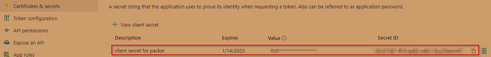

# Azure Infrastructure Operations Project: Deploying a scalable IaaS web server in Azure

### Introduction
For this project, you will write a Packer template and a Terraform template to deploy a customizable, scalable web server in Azure.

### Getting Started
1. Clone this repository

2. Create your infrastructure as code

3. Update this README to reflect how someone would use your code.

### Dependencies
1. Create an [Azure Account](https://portal.azure.com) 
2. Install the [Azure command line interface](https://docs.microsoft.com/en-us/cli/azure/install-azure-cli?view=azure-cli-latest)
3. Install [Packer](https://www.packer.io/downloads)
4. Install [Terraform](https://www.terraform.io/downloads.html)

### Instructions
#### Creating the Azure policy
```bash
az policy definition create --name tagging-policy --rules tagging-policy.json
```
Create the policy assignment in Azure:
```bash
az policy assignment create tagging-policy
```

Verify the policy assignment:
```bash
az policy assignment list
```
#### Setting the environment variables for the packer build
Find the subscription ID in Azure:


Create a simple app registration in Azure AD - the name Terraform was used here. Save the Client ID and create a client secret:



Using Git bash shell on Windows, create 3 environment variables as shown below:
```bash
export ARM_CLIENT_ID = <your_client_id>
export ARM_CLIENT_SECRET = <your_client_secret_value>
export ARM_SUBSCRIPTION_ID = <your_subscription_id>
```

#### Building the image with Packer
Use packer to build the image:
```bash
packer build server.json
```
Verify the image in Azure using the portal or the CLI:
```bash
az image list
```

#### Deploying the Terraform template
***Use the variables.tf file to customize the deployment parameters, or use the command line to specify values if the default values provided do not fit the requirements.

Run terraform plan to ensure there are no errors and to create the .plan file:
```bash
terraform plan -out solution.plan
```
Execute the terraform scripts to create the resources:
```bash
terraform apply solution.plan
```

### Output
Assuming there are no errors, Terraform will output a message indicating the number of resources created and/or changed. 
The resources can be viewed in the Azure Portal or by using the terraform show command:
```bash
terraform show
```

#### Destroying the resources
When finished, Terraform can easily tear down the environment to avoid additional costs in Azure:
```bash
terraform destroy
```
Use the show command to verify that the resources have been deleted:
```bash
terraform show
```

